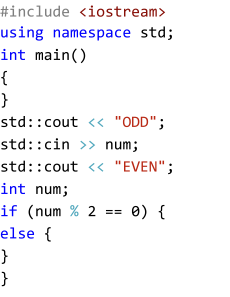

## Code Scrambler

This project was created for educational means. It is used to created 'scrambled' code so that other's can piece the code back together. It's not intended to be used as an advanced obfuscator but rather a simple educational utility.

This project uses SFML to render and highlight the image. In addition, this project only supports C++ as the target language.

### FLAGS
* **-file** - Specifies the location of the code to scramble.
  * If the path is a directory, then each file will be scrambled.
* **-diff** - Designates the difficulty of the outputted scrambled.
  * **0**=unchanged indentation, **1**=remove all code indentation.
* **-font** - Specifies the font to be used.
* **-border** - Indicate whether or not to use borders.
  * **0**=no border, **1**=solid border, **2**=dashed border.
* **-ppi** - Pixels per inch used to create an optimal image.
* **-fit** - How many times the code should be 'fitted' into a single image/page.
  * This should be used for smaller code bits, i.e, code that has less than 20 lines.


### SCRAMBLING
The symbol **~>** is used as a starting marker at the very beginning of a line of a code.

The symbol **<~** is used as an ending marker at the very end of a line of a code.

These symbols are used to 'fix' sections of code in place, i.e, prevent lines from being scrambled.

### OUTPUT
A file of the scrambled code will be created alongside a highlighted image.

### EXAMPLE
```c++
~>#include <iostream>
using namespace std;
int main()
{<~
	int num;
	std::cin >> num;
	if (num % 2 == 0) {
		std::cout << "EVEN";
	}
	else {
		std::cout << "ODD";
	}
~>}<~
```
In this example, lines 1-4 and 13 will remain fixed in position. On the other hand, lines 5-12 will be scrambled.
#### Output-Code
```
#include <iostream>
using namespace std;
int main()
{
}
std::cout << "ODD";
std::cin >> num;
std::cout << "EVEN";
int num;
if (num % 2 == 0) {
else {
}
}
```
#### Output-Image

